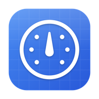
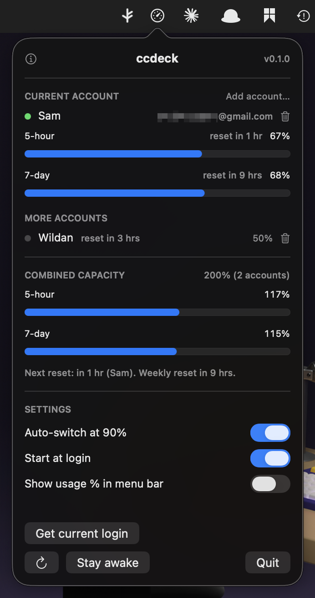
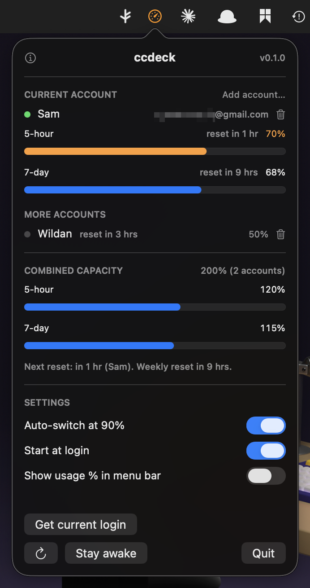
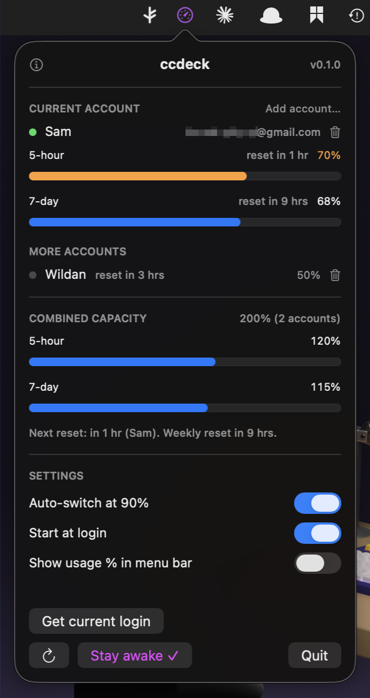
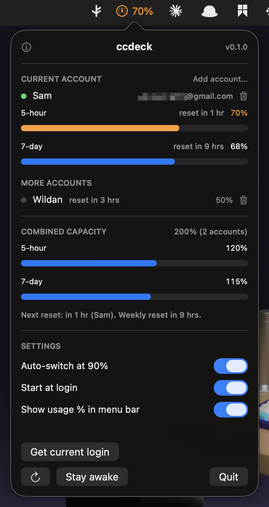

<p align="center">
  
</p>

<h1 align="center">CC Deck</h1>

macOS menu bar app that juggles **multiple Claude (claude.ai) subscriptions** for Claude Code.
See live quota for every account, switch between them in one click, and auto-rotate to a
fresh account when the current one hits its limit.

**Menu bar preview**

| **State**    | **Menu bar**                                        |
| :----------- | :-------------------------------------------------- |
| Idle         |            |
| Usage >70%   |  |
| Stay awake   |      |
| Show usage % |    |

> All accounts must be **your own paid subscriptions**. This is account management, not
> a way around paying for what you use.

## Features

- **Live quota** per account — current 5-hour window % and 7-day window %, with reset
  countdowns. Read from the same endpoint the `/usage` command uses.
- **One-click switch** between logged-in accounts.
- **Auto-rotate at 90%** — when the active account's window crosses the threshold, rotate
  to the account with the **soonest reset** (use-it-or-lose-it). When all accounts are
  exhausted, circle back to the first.
- **Usage snapshots** — each account's quota is polled every 60s and recorded to SQLite.

**Preview**

|                 Idle                  |                   Usage >70%                    |                 Stay awake                  |                 Show usage %                  |
| :-----------------------------------: | :---------------------------------------------: | :-----------------------------------------: | :-------------------------------------------: |
|  |  |  |  |

## How it works

Claude Code stores its OAuth token in the macOS Keychain under the service
`Claude Code-credentials`. ccdeck keeps a copy of each account's credential blob under
its own Keychain service (`ccdeck`) and, to "activate" an account, copies that blob into
the official entry. Quota polling reads each account's stored token directly — it never has
to switch accounts to read usage.

Quota comes from `GET https://api.anthropic.com/api/oauth/usage` (and `/api/oauth/profile`
for the account identity), authenticated with the account's OAuth access token.

## Limitations

- **Switching affects new sessions only.** A running `claude` process already holds its
  token in memory; swapping the Keychain entry changes which account the _next_ launch uses.
  Auto-rotate is for picking a fresh account at session start, not rescuing a session
  mid-burn.
- **Keychain access prompts — and "Always Allow" only sticks with a stable signature.**
  The official `Claude Code-credentials` item is owned by the Claude Code binary, so the
  first time ccdeck reads/writes it macOS asks for permission. _Always Allow_ pins the
  grant to the app's **code-signing identity** — so it only persists if the app is signed
  with a **stable** identity. An ad-hoc signature (the script's default) changes on every
  build, so macOS re-prompts each launch. Build with a real identity to make it stick:

  ```sh
  CODESIGN_IDENTITY="Apple Development: you@example.com (TEAMID)" ./scripts/utils/create_app_bundle.sh
  # list identities:  security find-identity -v -p codesigning
  ```

  Run the installed `.app` (not `swift run`, which re-signs ad-hoc every build).

- **Pro plans report no dollars/tokens** — only a utilization percentage. History is built
  from those percentages, not spend.
- **Token refresh is best-effort.** Background polling refreshes expired tokens via the
  OAuth token endpoint; if that fails, the account is flagged for re-login.

## Install

**Direct download (no Homebrew)** — grab the latest `.dmg` from the
[Releases page](https://github.com/wzulfikar/ccdeck/releases/latest), open it, and drag
**ccdeck** into Applications. The DMG is notarized and stapled, so Gatekeeper opens it with
no warning. Stable direct link:

https://github.com/wzulfikar/ccdeck/releases/latest/download/ccdeck.dmg

**Homebrew**

```sh
brew install --cask wzulfikar/tap/ccdeck
```

Requires macOS 14+.

---

## Build from source

```sh
swift build
swift run ccdeck
```

Requires macOS 14+ and a Swift 6 toolchain.

### First-time setup

1. Launch the app — a window appears and a gauge icon is added to the menu bar.
2. Click **Add account…**. A Terminal opens running `claude auth login`, which opens
   your browser. Sign in and paste the auth code back into the Terminal. The app
   **watches the Keychain and captures the account automatically** once login lands.
3. Repeat **Add account…** for each additional account (sign into a different account
   each time).
4. Toggle **Auto-switch at 90%** on if you want rotation.

> **Capture current login** is the manual fallback — if auto-capture times out, finish
> signing in and click it to save whatever Claude Code is currently logged into.

Closing the window leaves the app running in the menu bar. Reopen it via the menu's
**Open window** button.

## License

MIT
